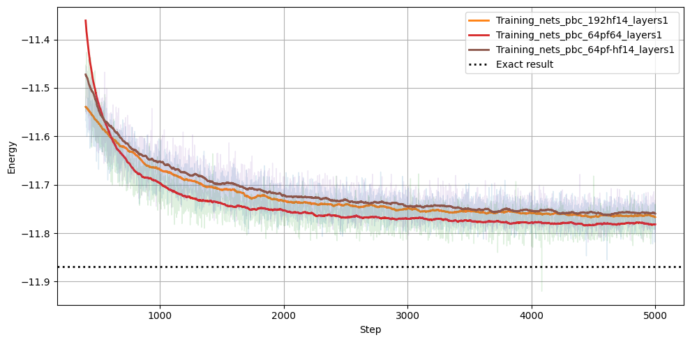
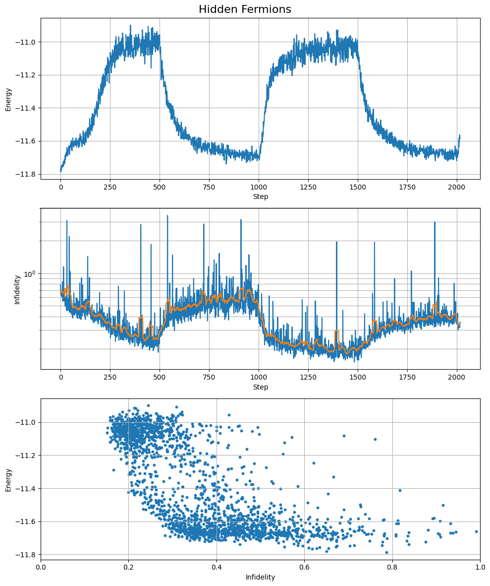
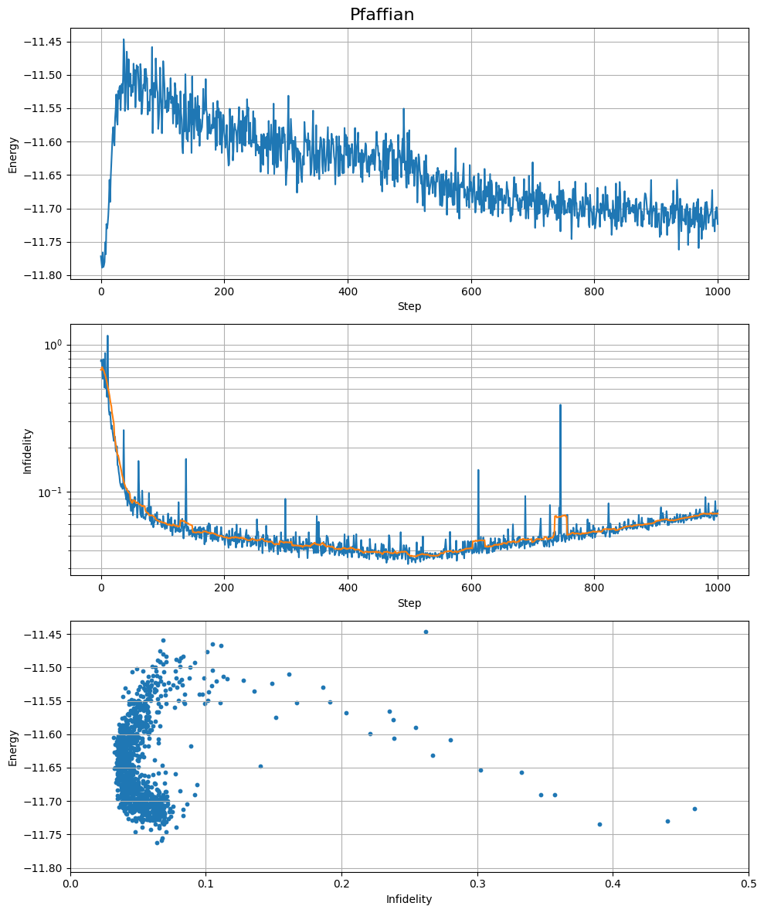

# Hubbard_ansatze
We implement some ansätze for the Hubbard model: Hidden Fermion and Pfaffian with neural networks.

The Hubbard model with periodic boundary conditions on a 4x4 Lattice with 7 up and 7 down electrons and U=8 is investigated, as it is close to possible superconductivity.

In the Hubbard4x4_hf_pf_combine jupyter notebook we investigate Hidden Fermion and Pfaffian approach. As an experiment we combine both approaches. This was done on a gtx1070ti, so it can actually be done on laptop too.

## Results

**Figure:** Comparison of hidden fermion (hf), Pfaffian (pf), and combined (pf-hf) ansätze during training, each with approximately 100k parameters.

Comparing with the exact solution may require up to about 128GB RAM in practice, but if you are patient, it can be done on cpu: 
We have hubbard_shell.cpp to calculate exact solution for the model, which can be used to compare the solutions. As hubbard_shell.cpp was created by an LLM and it was not able to produce netket compatible output we add a ReadEigen jupyter notebook to convert the output to netket.

hubbard_shell.cpp needs the petsc library with 64bit indexing enabled. This is not standard in anaconda for example!

The Expressivity notebook tries to get an idea of the expressivity of the ansatz by training it for energy while observing the overlap with one of the degenerated ground state vectors and training it for infidelity with the ground state, while observing the energy.

The trained wave function is first retrained for 500 steps for infidelity, than 500 steps energy etc.

## Hidden Fermion Approach

First, we employ the **hidden fermion approach** introduced in the article

> Javier Robledo Moreno, Giuseppe Carleo, Antoine Georges, and James Stokes,  
> *Fermionic wave functions from neural-network constrained hidden states*,  
> PNAS **119**, e2122059119 (2022).

### Reference

- Open-access PNAS article:  
  [PNAS Publication](https://www.pnas.org/doi/10.1073/pnas.2122059119?utm_source=chatgpt.com)

- Open-access arXiv preprint:  
  [arXiv:2111.10420](https://arxiv.org/abs/2111.10420?utm_source=chatgpt.com)

This method introduces additional hidden fermionic degrees of freedom
to construct highly expressive variational wave functions.

## Pfaffian Neural-Network Ansatz

Next, we employ a **Pfaffian-based variational ansatz** inspired by the recent work

> *Neural Pfaffians for Correlated Fermionic Quantum Systems* (2025)

### Reference

- arXiv preprint:  
  [arXiv:2507.10705](https://arxiv.org/abs/2507.10705)

Pfaffian wave functions provide a natural generalization of Slater
determinants and are particularly well suited for describing
pair-correlated fermionic states. In contrast to a determinant-based
ansatz, the Pfaffian formulation can efficiently encode pairing
correlations and superconducting structures.

